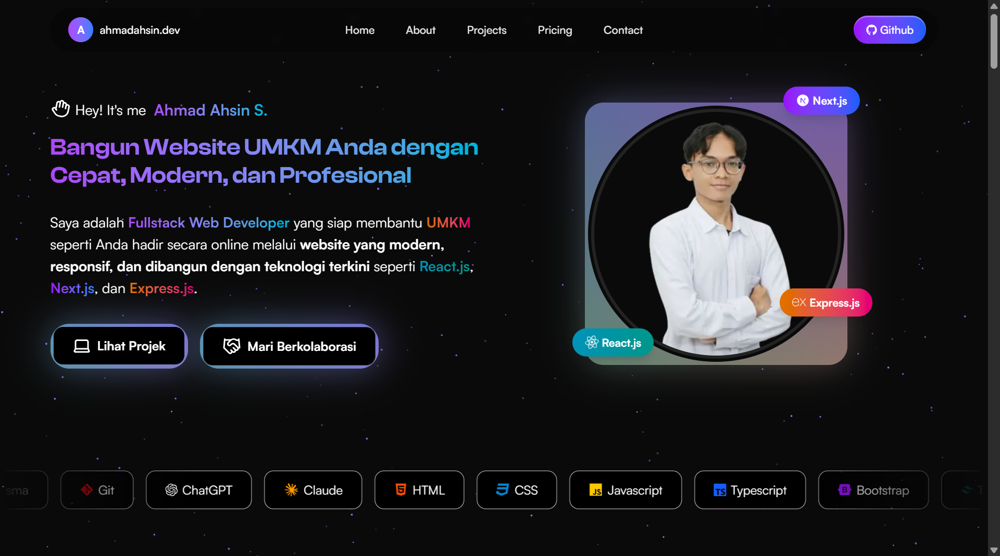

<h2> Hey!  It's me Ahmad </h2>

<h2> About Me</h2>

I'm Ahmad, a dedicated Fullstack Web Developer passionate about helping UMKMs (Small and Medium Enterprises) level up through digitalization. I build fast, modern, and user-friendly websites using cutting-edge technologies like React, Next.js, and Express.js — all at affordable prices for small and medium business owners.
As part of the #GoDigital movement, I want to ensure every UMKM has access to professional websites that can increase customer trust and expand their business reach online. I also leverage AI technology efficiently to accelerate the development process without sacrificing the quality of the final results.

- 🔭 Currently working on digitalizing UMKMs across Indonesia
- 🌱 Specializing in React, Next.js, Express.js, and modern web technologies
- 👯 Looking to collaborate with UMKM owners who want to go digital
- 💬 Ask me about web development, UMKM digitalization, or modern tech stack
- 📫 Visit my portfolio: [ahmadahsin.dev](https://www.ahmadahsin.dev/).
- ⚡ Fun fact: I believe every small business deserves a professional online presence!

<h2> Tech Stack</h2>

### Frontend

  
  
  
  
  
  
  
  
  
  
  
  
  

### Backend

  
  
  

### Database & Tools

  
  
    
  
    

  
  
  
  
  
  
  

    

<h2> GitHub Stats </h2>

  
  

<h2> GitHub Trophies</h2>

  

<h2>  Connect with Me </h2>

  
  
  
  

<h2> Current Goals</h2>

- 🚀 Help more UMKMs across Indonesia go digital
- 💡 Build affordable, professional web solutions for small businesses
- 🤝 Collaborate with UMKM owners to understand their digital needs
- 📈 Leverage AI technology to accelerate development without sacrificing quality
- 🌐 Contribute to the #GoDigital movement in Indonesia
- 📚 Continue learning modern web technologies to serve clients better

  

  
 Helping UMKMs Go Digital, One Website at a Time!

  
  Ready to take your business online? Let's build something amazing together!

